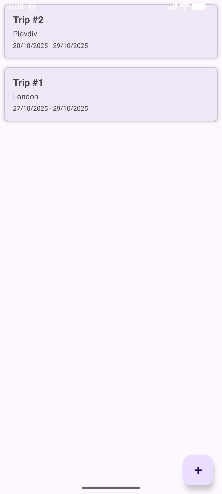
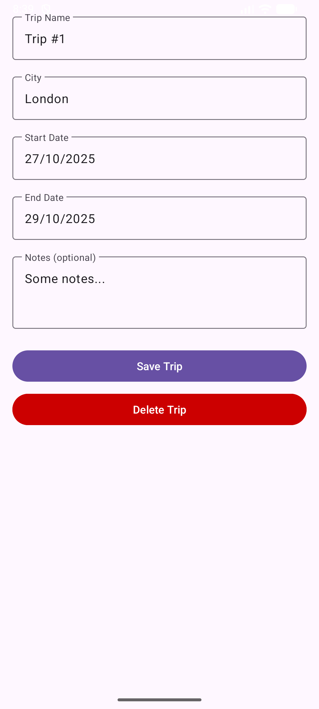
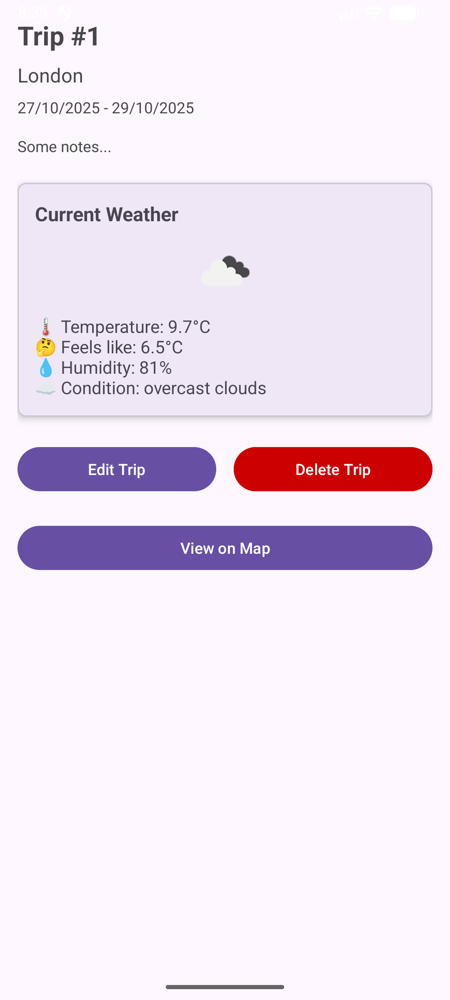
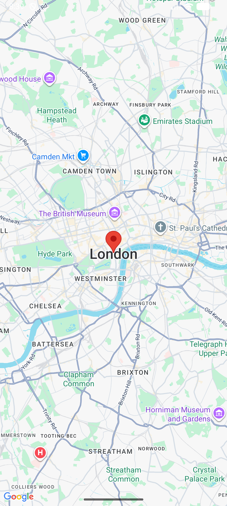
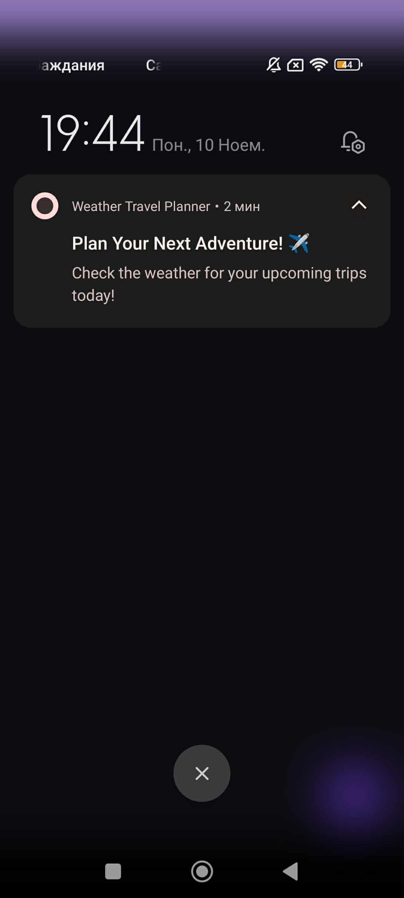

# Weather Travel Planner


**Автор:** Атанас Гюлчев  
**Факултетен номер:** 2301321018

## Описание на идеята

Weather Travel Planner е Android приложение за планиране на пътувания с интеграция на прогноза за времето. Приложението позволява на потребителите да създават, редактират и управляват планирани пътувания, като им предоставя актуална информация за времето в избраните дестинации, визуализация на картата и push notifications за напомняния.

## Как работи

Приложението използва MVVM архитектура с Room база данни за локално съхранение на данни и Retrofit за комуникация с REST API.

### Основни функционалности:
- **CRUD операции:** Създаване, преглед, редакция и изтриване на пътувания
- **Прогноза за времето:** Интеграция с OpenWeatherMap API за текуща прогноза
- **Визуализация на карта:** Google Maps показва локацията на избрания град
- **Push notifications:** Firebase Cloud Messaging за ежедневни напомняния
- **Persistent storage:** Room база данни запазва данните след рестарт

### API Integration:
- **OpenWeatherMap API:** За информация за времето (температура, влажност, условия)
- **Geocoding API:** За получаване на координати на градове
- **Google Maps SDK:** За визуализация на локации
- **Firebase Cloud Messaging:** За push notifications

## Архитектура

Приложението следва **MVVM (Model-View-ViewModel)** архитектурен pattern:
```
├── data/
│   ├── local/
│   │   ├── entity/       # Trip entity
│   │   ├── dao/          # TripDao
│   │   └── AppDatabase   # Room database
│   ├── remote/
│   │   ├── api/          # Retrofit services
│   │   └── models/       # API response models
│   └── repository/       # TripRepository
├── ui/
│   ├── trips/            # Trip list & Add/Edit
│   ├── details/          # Trip details with weather
│   └── map/              # Google Maps view
├── fcm/                  # Firebase Cloud Messaging
```

### Използвани технологии:
- **Kotlin** - основен език
- **Room Database** - локална база данни
- **Retrofit + Gson** - REST API комуникация
- **Google Maps SDK** - карти
- **Firebase Cloud Messaging** - push notifications
- **Material Design 3** - UI компоненти
- **Coroutines** - асинхронни операции
- **LiveData & ViewModel** - lifecycle-aware компоненти

## Потребителски поток

1. Приложението стартира и показва списък с планирани пътувания
2. Потребителят кликва на FAB бутона (+) за добавяне на ново пътуване
3. Попълва име, град, начална/крайна дата и бележки
4. Пътуването се запазва в Room базата данни
5. При кликване на пътуване се отваря екран с детайли:
   - Информация за пътуването
   - Текуща прогноза за времето с иконка
   - Бутони за редакция, изтриване и карта
6. При "View on Map" се показва локацията на Google Maps
7. Потребителят получава ежедневни push notifications с напомняния
8. Промените се запазват persistent в базата данни

## Инсталация и стартиране

### Предварителни изисквания:
- Android Studio Narwhal 2025.1.3 или по-нова версия
- Android SDK API 24+ (минимум)
- Android SDK API 36 (target)

### Стъпки:
1. Clone на repository:
```bash
   git clone https://github.com/AtanasG6/MobileApps2025-2301321018.git
```
2. Отворете проекта в Android Studio
3. Sync Gradle files
4. Стартирайте на емулатор или реално устройство

### API Keys:
Проектът използва API keys за OpenWeatherMap, Google Maps и Firebase. 
Ключовете са вградени в кода за улеснение на тестването (учебна цел).

## Тестови данни

Може да тествате приложението с реални градове като:
- Sofia
- Plovdiv
- London
- Paris
- New York
- Tokyo

## Скрийншотове

### Списък с пътувания


### Добавяне/Редактиране на пътуване


### Детайли с прогноза за времето


### Визуализация на карта


### Нотификация


## APK

Release APK файлът се намира в `/apk/app-release.apk`

Размер: 6.40 MB

## Тестване

Проектът включва:
- **2 Unit теста** за Repository и ViewModel слоя
- **1 UI тест** (Espresso) за основния потребителски поток

Изпълнение на тестовете:
```bash
./gradlew test                    # Unit tests
./gradlew connectedAndroidTest    # UI tests
```

## Firebase Cloud Messaging

Приложението е интегрирано с Firebase Cloud Messaging за push notifications. Настроена е ежедневна кампания за напомняния към потребителите.
